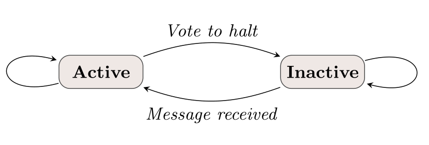
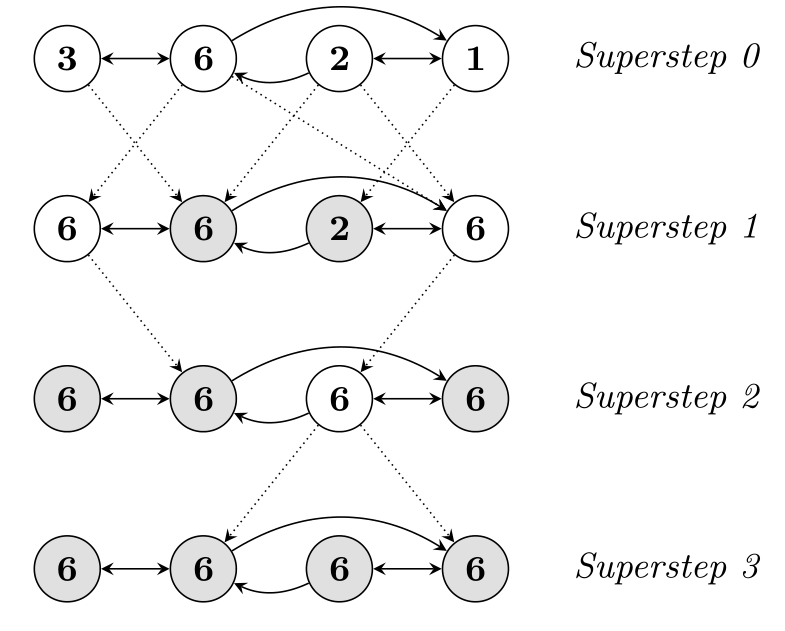

原文引用：Malewicz G, Austern M H, Bik A J C, et al. Pregel: a system for large-scale graph processing[C]// ACM SIGMOD International Conference on Management of Data. ACM, 2010:135-146.

<!--more-->

## ABSTRACT
Many practical computing problems concern large graphs. Standard examples include the Web graph and various social networks. The scale of these graphs—in some cases billions of vertices, trillions of edges—poses challenges to their efficient processing. In this paper we present a computational model suitable for this task. Programs are expressed as a sequence of iterations, in each of which a vertex can receive messages sent in the previous iteration, send messages to other vertices, and modify its own state and that of its outgoing edges or mutate graph topology. This vertex-centric approach is flexible enough to express a broad set of algorithms. The model has been designed for efficient, scalable and fault-tolerant implementation on clusters of thousands of commodity computers, and its implied synchronicity makes reasoning about programs easier. Distribution-related details are hidden behind an abstract API. The result is a framework for processing large graphs that is expressive and easy to program.

【译文】当今 Web 图和各种社交网络等许多实际问题都涉及到了大规模图计算。在某些情况下，图的规模达到数十亿顶点、数万亿边，这对图数据的高效处理提出了挑战。在本文中，我们提出了一个适用于此任务的计算模型。程序使用一系列迭代表示，且在迭代时顶点可以接收前一次迭代中发送的消息、向其他顶点发送消息、修改自身及其出边状态、还可以修改图的拓扑结构。这种以顶点为中心的方法足够灵活，可以表达一系列通用的算法。该模型的设计目的是在数千台商用机器集群上实现高效率、可扩展和高容错。其隐含的同步性使得程序更易理解分析。由于抽象 API 隐藏了与分布式相关的细节，使得这个框架在处理大规模图时，富有表现力且易于编程。

### Categories and Subject Descriptors
D.1.3 [Programming Techniques]: Concurrent Programming—Distributed programming; D.2.13 [Software Engineering]: Reusable Software—Reusable libraries

### General Terms
Design, Algorithms

### Keywords
Distributed computing, graph algorithms

## 1. INTRODUCTION
The Internet made the Web graph a popular object of analysis and research. Web 2.0 fueled interest in social networks. Other large graphs—for example induced by transportation routes, similarity of newspaper articles, paths of disease outbreaks, or citation relationships among published scientific work—have been processed for decades. Frequently applied algorithms include shortest paths computations, different flavors of clustering, and variations on the page rank theme. There are many other graph computing problems of practical value, e.g., minimum cut and connected components.

【译文】互联网使网络图成为分析和研究的热门对象，Web 2.0 更助长了研究者对社交网络的兴趣。其他大规模图——例如运输路线、报纸文章的相似网、疾病传播路径或已发表的科学着作之间的引文关系——已经处理了数十年。常用的算法包括最短路径计算、不同风格的聚类以及页面等级主题的变化。还有许多其他具有实际价值的图计算问题，例如最小切割和连通分量。

Efficient processing of large graphs is challenging. Graph algorithms often exhibit poor locality of memory access, very little work per vertex, and a changing degree of parallelism over the course of execution [31, 39]. Distribution over many machines exacerbates the locality issue, and increases the probability that a machine will fail during computation. Despite the ubiquity of large graphs and their commercial importance, we know of no scalable general-purpose system for implementing arbitrary graph algorithms over arbitrary graph representations in a large-scale distributed environment.

【译文】大图的高效处理依然存在挑战。图算法往往表现出较差的内存访问局部性，每个顶点的工作量很小，并且在执行过程中并发性程度不断变化[31,39]。 机器集群分布式更是加剧了局部性问题，增加了机器在计算过程中失败的可能性。 尽管大型图无处不在，其商业价值也十分重要，但在大规模分布式环境下，还没有能实现任意图算法的可扩展通用系统。

Implementing an algorithm to process a large graph typically means choosing among the following options:

【译文】实现一个处理大图的算法通常意味着在以下选项中进行选择：

1.Crafting a custom distributed infrastructure, typically requiring a substantial implementation effort that must be repeated for each new algorithm or graph representation.

【译文】构建一个定制的分布式基础架构，通常需要对每个新算法或图表示重复大量实现工作。

2.Relying on an existing distributed computing platform, often ill-suited for graph processing. MapReduce [14], for example, is a very good fit for a wide array of large-scale computing problems. It is sometimes used to mine large graphs [11, 30], but this can lead to sub-optimal performance and usability issues. The basic models for processing data have been extended to facilitate aggregation [41] and SQL-like queries [40, 47], but these extensions are usually not ideal for graph algorithms that often better fit a message passing model.

【译文】依靠现有的分布式计算平台，往往不适合大图处理。例如，被用于各种大规模计算问题的 MapReduce [14] 框架，虽然它有时也用于大图挖掘 [11,30]，但可能导致次优性能和可用性问题。处理数据的基本模型已被扩展以完成聚合运算[41] 和类 SQL 查询[40,47]，但这些扩展对于更适合消息传递模型的图算法来说，通常并不理想。

3.Using a single-computer graph algorithm library, such as BGL [43], LEDA [35], NetworkX [25], JDSL [20], Stanford GraphBase [29], or FGL [16], limiting the scale of problems that can be addressed.

【译文】使用 BGL [43]，LEDA [35]，NetworkX [25]，JDSL [20]，Stanford GraphBase [29] 或 FGL [16] 等单机图形算法库，则可能存在处理规模受限的问题。

4.Using an existing parallel graph system. The Parallel BGL [22] and CGMgraph [8] libraries address parallel graph algorithms, but do not address fault tolerance or other issues that are important for very large scale distributed systems.

【译文】使用现有的并行图形系统。Parallel BGL [22] 和 CGMgraph [8] 库提供了并行图算法，但没有解决对于超大规模分布式系统来说很重要的容错等问题。

None of these alternatives fit our purposes. To address distributed processing of large scale graphs, we built a scalable and fault-tolerant platform with an API that is sufficiently flexible to express arbitrary graph algorithms. This paper describes the resulting system, called Pregel$^1$ , and reports our experience with it.

【译文】这些替代品都不符合我们的目的。为了解决大规模图的分布式处理问题，我们构建了一个可扩展且高容错的平台，其 API 的灵活性足以表达任意图算法。本文介绍了由此产生的系统，称为 Pregel$^1$，并报告了我们的经验。

The high-level organization of Pregel programs is inspired by Valiant’s Bulk Synchronous Parallel model [45]. Pregel computations consist of a sequence of iterations, called supersteps. During a superstep the framework invokes a user-defined function for each vertex, conceptually in parallel. The function specifies behavior at a single vertex V and a single superstep S. It can read messages sent to V in superstep S - 1, send messages to other vertices that will be received at superstep S + 1, and modify the state of V and its outgoing edges. Messages are typically sent along outgoing edges, but a message may be sent to any vertex whose identifier is known.

【译文】Pregel 程序的高级结构受到了 Valiant 的 Bulk Synchronous Parallel 模型的启发[45]。Pregel 计算由一系列迭代组成，称为超级步。在超级步期间，框架逻辑上会为每个顶点并行调用用户自定义函数。该函数指定单个顶点 V 在单次超级 S 期间的行为。它可以读取 S-1 超级步中发送给 V 的消息，也可以将消息发送到 S+1 超级步的其他顶点，或者修改 V 和及其出边状态。消息通常沿传出边缘发送，但消息可以发送到任何已知的顶点。

The vertex-centric approach is reminiscent of MapReduce in that users focus on a local action, processing each item independently, and the system composes these actions to lift computation to a large dataset. By design the model is well suited for distributed implementations: it doesn’t expose any mechanism for detecting order of execution within a superstep, and all communication is from superstep S to superstep S + 1.

【译文】以顶点为中心的方法容易让人想起 MapReduce，MapReduce 框架下用户仅关注本地操作，独立处理每个项目，最后由系统组合这些操作以将计算提升到大型数据集。通过设计，该模型非常适合分布式实现：它没有公开检测超级步内部执行顺序的任何机制，并且所有通信都从超级 S 到超级 S+1。

The synchronicity of this model makes it easier to reason about program semantics when implementing algorithms, and ensures that Pregel programs are inherently free of dead-locks and data races common in asynchronous systems. In principle the performance of Pregel programs should be competitive with that of asynchronous systems given enough parallel slack [28, 34]. Because typical graph computations have many more vertices than machines, one should be able to balance the machine loads so that the synchronization between supersteps does not add excessive latency.

【译文】这种模型的同步性使得在实现算法时更容易理解程序语义，并确保 Pregel 程序从根本上没有异步系统中常见的死锁和数据竞争。原理上，Pregel 程序的性能应该与异步系统的性能相当，并给出足够的并行余量[28,34]。 由于典型的图形计算比机器具有更多的顶点，因此系统应该平衡机器负载，使得超级步之间的同步不会增加过多的延迟。

The rest of the paper is structured as follows. Section 2 describes the model. Section 3 describes its expression as a C++ API. Section 4 discusses implementation issues, including performance and fault tolerance. In Section 5 we present several applications of this model to graph algorithm problems, and in Section 6 we present performance results. Finally, we discuss related work and future directions.

本文的其余部分的结构如下。 第 2 节描述了该模型。第 3 节将其表达式描述为 C++ API。 第 4 节讨论实现问题，包括性能和容错。 在第 5 节中，我们介绍了该模型在图算法问题中的几个应用，并在第 6 节中给出性能结果。 最后，我们讨论相关的工作和未来的方向。

## 2. MODEL OF COMPUTATION
The input to a Pregel computation is a directed graph in which each vertex is uniquely identified by a string vertex identifier. Each vertex is associated with a modifiable, user defined value. The directed edges are associated with their source vertices, and each edge consists of a modifiable, user defined value and a target vertex identifier.

【译文】Pregel 计算的输入是一个有向图，其中每个顶点由一个标识符唯一标识。 每个顶点都关联一个可修改的用户定义值。 有向边与它们的源顶点相关联，并且每个边由可变的用户定义值和目标顶点标识符组成。

A typical Pregel computation consists of input, when the graph is initialized, followed by a sequence of supersteps separated by global synchronization points until the algorithm terminates, and finishing with output.

【译文】典型的 Pregel 计算包括输入、初始化、全局同步点分隔的超级步序列、算法终止后的输出。

Within each superstep the vertices compute in parallel, each executing the same user-defined function that expresses the logic of a given algorithm. A vertex can modify its state or that of its outgoing edges, receive messages sent to it in the previous superstep, send messages to other vertices (to be received in the next superstep), or even mutate the topology of the graph. Edges are not first-class citizens in this model, having no associated computation.

【译文】在每个超级步中，顶点并行计算，每个顶点都执行相同的用户定义的函数，以表示给定算法的逻辑。 一个顶点可以修改它的状态或其出边的状态，接收在前一个超级步中发送给它的消息，发送消息到其他顶点（在下一个超级步中接收），甚至改变图的拓扑结构。 边不是这个模型中的一等公民，没有相关的计算。

Algorithm termination is based on every vertex voting to halt. In superstep 0, every vertex is in the active state; all active vertices participate in the computation of any given superstep. A vertex deactivates itself by voting to halt. This means that the vertex has no further work to do unless triggered externally, and the Pregel framework will not execute that vertex in subsequent supersteps unless it receives a message. If reactivated by a message, a vertex must explicitly deactivate itself again. The algorithm as a whole terminates when all vertices are simultaneously inactive and there are no messages in transit. This simple state machine is illustrated in Figure 1.

【译文】算法终止由每个顶点投票决定的。 在超级步 0 中，所有顶点都处于激活状态; 每次超级步中由所有有效顶点参与计算。顶点通过投票而使自身处于非激活状态。 这意味着顶点在外部触发之前没有其他工作要做，那么 Pregel 框架不会在随后的超级步骤中执行该顶点，除非它有接收到消息。 如果通过消息重新激活，则顶点将必须再次伺机停用自己。 当所有顶点同时处于非活动状态并且没有传输中的消息时，该算法整体终止。 这个简单的状态机如图1所示。

The output of a Pregel program is the set of values explicitly output by the vertices. It is often a directed graph isomorphic to the input, but this is not a necessary property of the system because vertices and edges can be added and removed during computation. A clustering algorithm, for example, might generate a small set of disconnected vertices selected from a large graph. A graph mining algorithm might simply output aggregated statistics mined from the graph.

【译文】Pregel 程序的输出是由顶点显式输出的一组值。 它通常是一个与输入同构的有向图，但这不是系统的必要属性，因为在计算过程中可以添加和移除顶点和边。 例如，聚类算法可能会生成从大图中选择的一小组断开的顶点。 图挖掘算法可以简单地输出图中挖掘的聚合统计数据。

Figure 2 illustrates these concepts using a simple example: given a strongly connected graph where each vertex contains a value, it propagates the largest value to every vertex. In each superstep, any vertex that has learned a larger value from its messages sends it to all its neighbors. When no further vertices change in a superstep, the algorithm terminates.

【译文】图 2 用一个简单的例子说明了这些概念：给定一个强连通图，其中每个顶点都包含一个值，它将最大值传播到每个顶点。 在每个超级步中，从其消息中学到更大值的任何顶点都会将其发送给所有邻居。 当超级步中没有顶点改变时，算法终止。

We chose a pure message passing model, omitting remote reads and other ways of emulating shared memory, for two reasons. First, message passing is sufficiently expressive that there is no need for remote reads. We have not found any graph algorithms for which message passing is insufficient. Second, this choice is better for performance. In a cluster environment, reading a value from a remote machine incurs high latency that can’t easily be hidden. Our message passing model allows us to amortize latency by delivering messages asynchronously in batches.

【译文】我们选择纯粹的消息传递模型，省略了远程读取和其他模拟共享内存的方式，原因有两个。 首先，消息传递表达能力已足够，不需要远程读取。 我们还没有找到任何消息传递模型无法表达的图算法。 其次，这种选择对性能更好。 在集群环境中，从远程计算机读取值会导致难以隐藏的高延迟。 我们的消息传递模型允许我们通过批量异步传递消息来缓解延迟。

Graph algorithms can be written as a series of chained MapReduce invocations [11, 30]. We chose a di↵erent model for reasons of usability and performance. Pregel keeps vertices and edges on the machine that performs computation, and uses network transfers only for messages. MapReduce, however, is essentially functional, so expressing a graph algorithm as a chained MapReduce requires passing the entire state of the graph from one stage to the next—in general requiring much more communication and associated serialization overhead. In addition, the need to coordinate the steps of a chained MapReduce adds programming complexity that is avoided by Pregel’s iteration over supersteps.

【译文】图算法可以写成一系列链接的 MapReduce 调用[11,30]。 出于可用性和性能的原因，我们选择了不同的模型。 Pregel 在执行计算的机器上保留顶点和边，并仅将网络传输用于消息。然而，MapReduce 本质上是函数式的，因此将图算法表示为链式 MapReduce 需要将图形的整个状态从一个阶段传递到下一个阶段，通常需要更多的通信和相关的串行化开销。另外，协调链接 MapReduce 步骤的需要增加了 Pregel 迭代超级节点时所避免的编程复杂性。

## 3. THE C++ API
This section discusses the most important aspects of Pregel’s C++ API, omitting relatively mechanical issues.

【译文】本节讨论 Pregel 的 C++ API 最重要的方面，省略了相对古板的问题。

Writing a Pregel program involves subclassing the predefined Vertex class (see Figure 3). Its template arguments define three value types, associated with vertices, edges, and messages. Each vertex has an associated value of the specified type. This uniformity may seem restrictive, but users can manage it by using flexible types like protocol buffers [42]. The edge and message types behave similarly.

【译文】编写 Pregel 程序涉及对预定义的 Vertex 类进行子类化（参见图3）。 它的模板参数定义了三个值类型，分别与顶点、边和消息相关联。 每个顶点都有一个关联类型的值。这种一致性可能看起来有限制，但用户可以通过使用灵活类型（如协议缓冲区）来管理它[42]。 边和消息类型的行为相似。

The user overrides the virtual Compute() method, which will be executed at each active vertex in every superstep. Predefined Vertex methods allow Compute() to query information about the current vertex and its edges, and to send messages to other vertices. Compute() can inspect the value associated with its vertex via GetValue() or modify it via MutableValue(). It can inspect and modify the values of out-edges using methods supplied by the out-edge iterator. These state updates are visible immediately. Since their visibility is confined to the modified vertex, there are no data races on concurrent value access from di↵erent vertices.

【译文】用户重写虚拟 Compute() 方法，该方法将在每次超级步的每个活动顶点执行。 预定义的顶点方法允许 Compute() 查询有关当前顶点及其边的信息，并将消息发送到其他顶点。  Compute() 可以通过 GetValue() 检查与其顶点关联的值，也可以通过 MutableValue() 对其进行修改。 它可以使用出边迭代器提供的方法检查和修改出边的值。 这些状态更新立即可见。 由于它们的可见性仅限于修改的顶点，所以不存在来自不同顶点对值并发访问带来的数据争用。

The values associated with the vertex and its edges are the only per-vertex state that persists across supersteps. Limiting the graph state managed by the framework to a single value per vertex or edge simplifies the main computation cycle, graph distribution, and failure recovery.

【译文】与顶点及其边相关的值在跨超级步时可以被持久化。 框架将图限制为每个顶点或边仅为单个值状态，这种管理方式可简化主计算周期，图分布和故障恢复。

### 3.1 Message Passing
Vertices communicate directly with one another by sending messages, each of which consists of a message value and the name of the destination vertex. The type of the message value is specified by the user as a template parameter of the Vertex class. A vertex can send any number of messages in a superstep. All messages sent to vertex V in superstep S are available, via an iterator, when V ’s Compute() method is called in superstep S + 1. There is no guaranteed order of messages in the iterator, but it is guaranteed that messages will be delivered and that they will not be duplicated.

【译文】顶点通过发送消息直接相互通信，这些消息由一个消息值和目标顶点的名称组成，而消息值的类型则由用户指定的 Vertex 模板的参数。 一个顶点可以发送任意数量的超级消息。 V 在超级步 S+1 中调用 Compute() 方法时，可以通过迭代器访问超级步 S 中发送到顶点 V 的所有消息。迭代器不保证消息传送的顺序，但可以保证消息一定能被访问，并且不会重复。

A common usage pattern is for a vertex V to iterate over its outgoing edges, sending a message to the destination vertex of each edge, as shown in the PageRank algorithm in Figure 4 (Section 5.1 below). However, dest_vertex need not be a neighbor of V . A vertex could learn the identifier of a non-neighbor from a message received earlier, or vertex identifiers could be known implicitly. For example, the graph could be a clique, with well-known vertex identifiers V 1 through V n , in which case there may be no need to even keep explicit edges in the graph.

【译文】顶点 V 遍历边的一般用于向每个边的目标顶点发送消息，如图4（下面的第5.1节）中的 PageRank 算法所示。 但是，dest_vertex 不一定是 V 的邻居。 顶点可以从之前收到的消息中学习非邻居的标识符，或者隐式地知道顶点标识符。 例如，该图可以是全连接团，具有直接的顶点标识符 $V_1$至 $V_n$，在这种情况下，甚至可能不需要保留图中的显式边。

When the destination vertex of any message does not exist, we execute user-defined handlers. A handler could, for example, create the missing vertex or remove the dangling edge from its source vertex.

【译文】当消息的目标顶点不存在时，则执行用户定义的处理程序。 例如，处理程序可以创建缺失的顶点或从其源顶点移除悬挂边等。

### 3.2 Combiners
Sending a message, especially to a vertex on another machine, incurs some overhead. This can be reduced in some cases with help from the user. For example, suppose that Compute() receives integer messages and that only the sum matters, as opposed to the individual values. In that case the system can combine several messages intended for a vertex V into a single message containing their sum, reducing the number of messages that must be transmitted and bu↵ered.

【译文】发送消息，尤其是发送到另一台机器上的顶点时，会产生一些开销。在某些情况下，有用户的帮助可以减少这些开销。 例如，假设 Compute() 接收整数消息，并且只有总和很重要，而不是单个值。 在这种情况下，系统可以将发送给顶点 V 的几条消息组合成为其总和的单个消息，从而减少必须传输和分发的消息数量。

Combiners are not enabled by default, because there is no mechanical way to find a useful combining function that is consistent with the semantics of the user’s Compute() method. To enable this optimization the user subclasses the Combiner class, overriding a virtual Combine() method. There are no guarantees about which (if any) messages are combined, the groupings presented to the combiner, or the order of combining, so combiners should only be enabled for commutative and associative operations.

【译文】组合器默认情况下未启用，因为没有任何机制可以找到与用户的 Compute() 方法的语义一致的 combine 方法。 要启用此优化，用户需要将 Combiner 类进行子类化，覆盖虚拟的 Combine() 方法。 由于不会保证哪些消息被组合、顺序如何、分组如何，所以组合器应该仅被用于通信的相关操作。

For some algorithms, such as single-source shortest paths (Section 5.2), we have observed more than a fourfold reduction in message traffic by using combiners.

【译文】对于一些算法，如单源最短路径（第5.2节），我们观察到通过使用组合器消息流量减少了四倍。

### 3.3 Aggregators
Pregel aggregators are a mechanism for global communication, monitoring, and data. Each vertex can provide a value to an aggregator in superstep S, the system combines those values using a reduction operator, and the resulting value is made available to all vertices in superstep S + 1. Pregel includes a number of predefined aggregators, such as min, max, or sum operations on various integer or string types.

【译文】Pregel 聚合器是全局通信、监控和数据的一种机制。 每个顶点都可以在超级步 S 中为聚合器提供值，系统使用缩减操作（reduce）组合这些值，并将结果值提供给超级步 S+1 中的所有顶点。Pregel 包括许多预定义聚合器，例如 min、max 或 sum 操作的各种整数或字符串类型。

