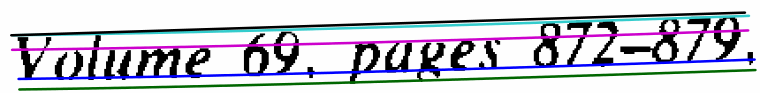
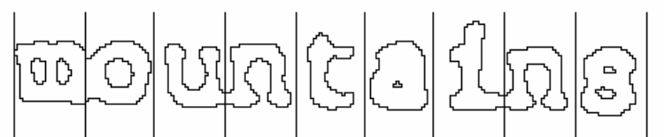
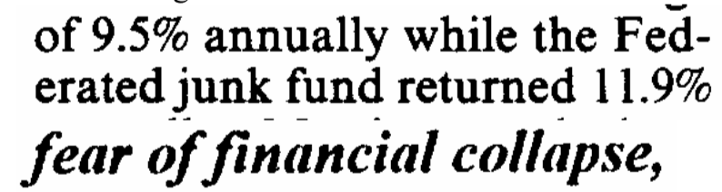
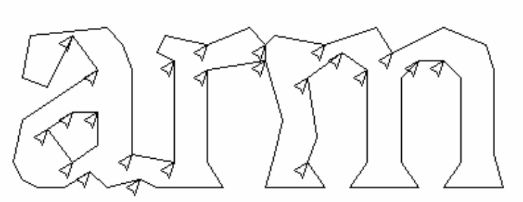
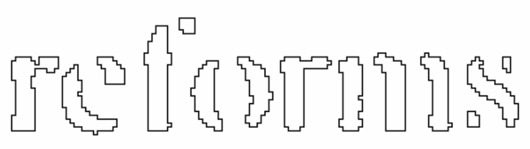
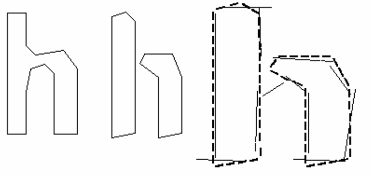
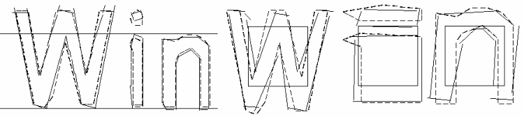

## 3. 行和单词发现
### 3.1. 行发现

### 3.2. Baseline Fitting 基线拟合
Once the text lines have been found, the baselines are fitted more precisely using a quadratic spline. This was another first for an OCR system, and enabled Tesseract to handle pages with curved baselines [5], which are a common artifact in scanning, and not just at book bindings.

找到文本行后，使用二次样条曲线可以更精确地拟合基线。这是该 OCR 系统的另一个第一，使得 Tesseract 能够处理具有弯曲基线的页面[5]。

The baselines are fitted by partitioning the blobs into groups with a reasonably continuous displacement for the original straight baseline. A quadratic spline is fitted to the most populous partition, (assumed to be the baseline) by a least squares fit. The quadratic spline has the advantage that this calculation is reasonably stable, but the disadvantage that discontinuities can arise when multiple spline segments are required. A more traditional cubic spline [6] might work better.

通过将 Blob 分成组来拟合基线，其中原始直线基线做了合理的、连续的位移。 通过最小二乘拟合，将二次样条拟合到密度高的分区（假设为基线）。 二次样条具有计算相当稳定的优点，但也有当需要多个样条段时可能出现不连续性的缺点。更传统的三次样条[6]可能会更有效。

Fig.1 shows an example of a line of text with a fitted baseline, descender line, meanline and ascender line. All these lines are “parallel” (the y separation is a constant over the entire length) and slightly curved. The ascender line is cyan (prints as light gray) and the black line above it is actually straight. Close inspection shows that the cyan/gray line is curved relative to the straight black line above it.

图1显示了具有拟合基线，下降线，平均线和上升线的文本行示例。 所有线并排（整个长度在 y 上间隔恒定）并且略微弯曲。 上升线为青色（打印为浅灰色），上方的黑线实际上是直的。 仔细检查能发现青色/灰色线相对弯曲于其上方的黑色直线。

### 3.3. Fixed Pitch Detection and Chopping 定间距检测与切词
Tesseract tests the text lines to determine whether they are fixed pitch. Where it finds fixed pitch text, Tesseract chops the words into characters using the pitch, and disables the chopper and associator on these words for the word recognition step. Fig. 2 shows a typical example of a fixed-pitch word.

Tesseract 测试文本行以确定它们是否是固定间距（pitch）。 若是，Tesseract 通过固定间距将单词切成字符，并在这些单词的识别步骤时，禁用切词器和关联器。 图2示出了固定间距字的典型示例。

    

### 3.4. Proportional Word Finding

Non-fixed-pitch or proportional text spacing is a highly non-trivial task. Fig. 3 illustrates some typical problems. The gap between the tens and units of ‘11.9%’ is a similar size to the general space, and is certainly larger than the kerned space between ‘erated’ and ‘junk’. There is no horizontal gap at all between the bounding boxes of ‘of’ and ‘financial’. Tesseract solves most of these problems by measuring gaps in a limited vertical range between the baseline and mean line. Spaces that are close to the threshold at this stage are made fuzzy, so that a final decision can be made after word recognition.

非固定间距或比例文本间距是一项非常重要的任务。 图3说明了一些典型问题。 '11.9％'的十和单位之间的间距与一般空间大小相当，肯定大于'erated'和'junk'之间的间距。 “of”和“financial”的边界框之间没有水平间隙。 Tesseract通过测量基线和平均线之间有限垂直范围内的间隙来解决大多数这些问题。 在此阶段接近阈值的空间变得模糊，因此可以在识别字之后做出最终决定。

注：如果是中文，是不是应该是：宝盖头->走之旁。。。

注：如果是手写体的话，应该是用猜的，再去脑补

注：手写体和印刷体还有不同的，是手写体比较直，没有毛刺

注：也就是王斌老师说的，“软”分词

## 4. Word Recognition

Part of the recognition process for any character recognition engine is to identify how a word should be segmented into characters. The initial segmentation output from line finding is classified first. The rest of the word recognition step applies only to non-fixed-pitch text.

“识别单词应如何被分割成字符” 都是任何字符识别引擎的识别过程的一部分。 首先先分类文本行查找的初始分段输出。 单词识别步骤的其余部分只适用于非固定间距文字。

### 4.1 Chopping Joined Characters 分割粘连字符
While the result from a word (see section 6) is unsatisfactory, Tesseract attempts to improve the result by chopping the blob with worst confidence from the character classifier. Candidate chop points are found from concave vertices of a polygonal approximation [2] of the outline, and may have either another concave vertex opposite, or a line segment. It may take up to 3 pairs of chop points to successfully separate joined characters from the ASCII set.

虽然单词的结果（参见第6节）并不令人满意，但 Tesseract 试图通过从字符分类器中以最差的信心砍掉 blob 来改善结果。 候选分割点是从轮廓的多边形近似[2]的凹顶点找到的，并且可以具有相对的另一个凹顶点或线段。 最多可能需要 3 对分割点才能成功地将连接的字符与 ASCII 集分开。

Fig. 4 shows a set of candidate chop points with arrows and the selected chop as a line across the outline where the ‘r’ touches the ‘m’. Chops are executed in priority order. Any chop that fails to improve the confidence of the result is undone, but not completely discarded so that the chop can be re-used later by the associator if needed.

图4示出了一组带有箭头的候选削切点和所选择的削切线作为贯穿 'r' 接触 'm' 的轮廓线。CHOP是按优先级顺序执行的。任何未能改善结果置信度的分割都会被撤销，但未完全丢弃，以便在需要时可由关联器重新使用。

### 4.2. Associating Broken Characters 关联破碎的字符
When the potential chops have been exhausted, if the word is still not good enough, it is given to the associator. The associator makes an A* (best first) search of the segmentation graph of possible combinations of the maximally chopped blobs into candidate characters. It does this without actually building the segmentation graph, but instead maintains a hash table of visited states. The A* search proceeds by pulling candidate new states from a priority queue and evaluating them by classifying unclassified combinations of fragments. 

当潜在的分割已经用尽时，如果单词仍然不够好，则将其提供给关联者。 关联器对最大切碎的斑点的可能组合的候选字符的分割图进行A *（最佳第一）搜索。 它在没有实际构建分段图的情况下执行此操作，而是维护访问状态的哈希表。 A *搜索通过从优先级队列中提取候选新状态并通过对未分类的片段组合进行分类来评估它们。

It may be argued that this fully-chop-then-associate approach is at best inefficient, at worst liable to miss important chops, and that may well be the case. The advantage is that the chop-then-associate scheme simplifies the data structures that would be required to maintain the full segmentation graph.

可能有人认为，这种 chop-then-associate 的方法效率低下且可能错过重要的分割，而且很可能就是这种情况。 但 chop-then-associate 方案简化了维护完整分段图所需的数据结构。

When the A* of segmentation search was first implemented in about 1989, Tesseract’s accuracy on broken characters was well ahead of the commercial engines of the day. Fig. 5 is a typical example. An essential part that success was the character classifier that could easily recognize broken characters.

当分段搜索的A *在大约1989年首次实现时，Tesseract对破碎字符的准确性远远超过当时的商业引擎。 图5是典型的例子。 成功的一个重要部分是可以轻松识别破碎字符的字符分类器。

## 5. Static Character Classifier
### 5.1. Features
An early version of Tesseract used topological features developed from the work of Shillman et. al. [7-8] Though nicely independent of font and size, these features are not robust to the problems found in reallife images, as Bokser [9] describes. An intermediate idea involved the use of segments of the polygonal approximation as features, but this approach is also not robust to damaged characters. For example, in Fig. 6(a), the right side of the shaft is in two main pieces, but in Fig. 6(b) there is just a single piece.

Tesseract的早期版本使用了Shillman等人的工作开发的拓扑特征[7-8]。 正如Bokser [9]所描述的那样，虽然很好地独立于字体和大小，但这些特征对于现实生活图像中发现的问题并不健壮。 中间思想涉及使用多边形近似的片段作为特征，但是这种方法对于受损字符也不健壮。 例如，在图6（a）中，轴的右侧是两个主要部件，但是在图6（b）中只有一个部件。

The breakthrough solution is the idea that the features in the unknown need not be the same as the features in the training data. During training, the segments of a polygonal approximation [2] are used for features, but in recognition, features of a small, fixed length (in normalized units) are extracted from the outline and matched many-to-one against the clustered prototype features of the training data. In Fig. 6(c), the short, thick lines are the features extracted from the unknown, and the thin, longer lines are the clustered segments of the polygonal approximation that are used as prototypes. One prototype bridging the two pieces is completely unmatched. Three features on one side and two on the other are unmatched, but, apart from those, every prototype and every feature is well matched. This example shows that this process of small features matching large prototypes is easily able to cope with recognition of damaged images. Its main problem is that the computational cost of computing the distance between an unknown and a prototype is very high.

突破性的解决方案是，未知特征不一定与训练数据中的特征相同。在训练过程中，多边形近似[2]的片段用于特征，但在识别中，从轮廓中提取小的固定长度（以标准化单位）的特征，并与训练数据的原型特征组进行多对一匹配。在图6（c）中，短粗线是从未知中提取的特征，细长线是用作原型的多边形近似的聚类段。桥接两件的原型完全无法匹配。一侧有三个特征，另一侧有两个特征是没有匹配到的，但除此之外，每个原型和每个功能都很匹配。这个例子表明，这个小特征匹配大原型的过程很容易应对损坏图像的识别。它的主要问题是计算未知和原型之间距离的计算成本非常高。

The features extracted from the unknown are thus 3-dimensional, (x, y position, angle), with typically 50-100 features in a character, and the prototype features are 4-dimensional (x, y, position, angle, length), with typically 10-20 features in a prototype configuration.

从未知提取的特征是这样的3维（x，y位置，角度），并在一个字符通常50-100特征和原型特征是4维（X，Y，位置，角度，长度） ，在一个原型配置通常10-20特征。

### 5.2. Classification
Classification proceeds as a two-step process. In the first step, a class pruner creates a shortlist of character classes that the unknown might match. Each feature fetches, from a coarsely quantized 3-dimensional lookup table, a bit-vector of classes that it might match, and the bit-vectors are summed over all the features. The classes with the highest counts (after correcting for expected number of features) become the short-list for the next step.

分类以两步过程进行。 在第一步中，类修剪器创建未知可能匹配的字符类的候选列表。 每个特征从粗略量化的三维查找表中提取它可能匹配的类的位向量，并且在所有特征上对位向量求和。 具有最高计数的类（在校正预期的特征数之后）成为下一步的短名单。

Each feature of the unknown looks up a bit vector of prototypes of the given class that it might match, and then the actual keeps a record of the similarity between them is computed. Each prototype character class is represented by a logical sum-of-product expression with each term called a configuration, so the distance calculation process similarity total evidence of each feature in each configuration, as well as of each prototype. The best combined distance, which is calculated from the summed feature and prototype evidences, is the best over all the stored configurations of the class.

未知的每个特征查找它可能匹配的给定类的原型的一些向量，然后计算实际保持它们之间的相似性的记录。 每个原型字符类由逻辑和产品表达式表示，每个术语称为配置，因此距离计算过程相似性是每个配置中每个特征以及每个原型的总体证据。 从总和特征和原型证据计算出的最佳组合距离是该类所有存储配置的最佳组合距离。

### 5.3. Training Data
Since the classifier is able to recognize damaged characters easily, the classifier was not trained on damaged characters. In fact, the classifier was trained on a mere 20 samples of 94 characters from 8 fonts in a single size, but with 4 attributes (normal, bold, italic, bold italic), making a total of 60160 training samples. This is a significant contrast to other published classifiers, such as the Calera classifier with more than a million samples [9], and Baird’s 100-font classifier [10] with 1175000 training samples.

由于分类器能够容易地识别损坏的字符，因此分类器未对受损字符进行训练。 实际上，分类器仅使用单个大小的8种字体对仅有20个样本的94个字符进行了训练，但具有4个属性（正常，粗体，斜体，粗体斜体），总共制作了60160个训练样本。 这与其他已发表的分类器形成鲜明对比，例如Calera分类器有超过一百万个样本[9]，而Baird的100字体分类器[10]有1175000个训练样本。

## 6. Linguistic Analysis 语言学分析
Tesseract contains relatively little linguistic analysis. Whenever the word recognition module is considering a new segmentation, the linguistic module (mis-named the permuter) chooses the best available word string in each of the following categories: Top frequent word, Top dictionary word, Top numeric word, Top UPPER case word, Top lower case word (with optional initial upper), Top classifier choice word. The final decision for a given segmentation is simply the word with the lowest total distance rating, where each of the above categories is multiplied by a different constant.

Tesseract包含相对较少的语言分析。 每当单词识别模块考虑新的分段时，语言模块（错误地命名为permuter）在以下每个类别中选择最佳可用单词串：顶部常用单词，顶部字典单词，顶部数字单词，顶部UPPER案例单词 ，顶部小写字（带可选的初始上部），顶级分类器选择字。 给定分段的最终决定仅仅是具有最低总距离评级的单词，其中上述每个类别乘以不同的常数。

Words from different segmentations may have different numbers of characters in them. It is hard to compare these words directly, even where a classifier claims to be producing probabilities, which Tesseract does not. This problem is generating two solved in Tesseract by numbers for each character classification. The first, called the confidence, is minus the normalized distance from the prototype. This enables it to be a “confidence” in the sense that greater numbers are better, but still a distance, as, the farther from zero, the greater the distance. The second output, called the rating, multiplies the normalized distance from the prototype by the total outline length in the unknown character. Ratings for characters within a word can be summed meaningfully, since the total outline length for all characters within a word is always the same.

来自不同分段的单词可能具有不同数量的字符。 很难直接比较这些词，即使分类器声称产生概率，而Tesseract则没有。 这个问题是每个字符分类的数字生成两个在Tesseract中解决的问题。 第一个称为置信度，是减去原型的标准化距离。 这使得它成为一种“信心”，即更大的数字更好，但仍然是距离，因为距离零越远，距离越大。 第二个输出称为评级，将原型的标准化距离乘以未知字符的总轮廓长度。 单词中字符的等级可以有意义地求和，因为单词内所有字符的总轮廓长度始终相同。

## 7. Adaptive Classifier

It has been suggested [11] and demonstrated [12] that OCR engines can benefit from the use of an adaptive classifier. Since the static classifier has to be good at generalizing to any kind of font, its ability to discriminate between different characters or between characters and non-characters is weakened. A more font-sensitive adaptive classifier that is trained by the output of the static classifier is therefore commonly [13] used to obtain greater discrimination within each document, where the number of fonts is limited.

有人建议[11]并证明[12] OCR引擎可以从自适应分类器的使用中受益。 由于静态分类器必须善于推广到任何类型的字体，因此它在区分不同字符或字符与非字符之间的能力被削弱。 因此，通过静态分类器的输出训练的更加字体敏感的自适应分类器通常[13]用于在每个文档内获得更大的区分，其中字体的数量是有限的。

Tesseract does not employ a template classifier, but uses the same features and classifier as the static classifier. The only significant difference between the static classifier and the adaptive classifier, apart from the training data, is that the adaptive classifier uses isotropic baseline/x-height normalization, whereas the static classifier normalizes characters by the centroid (first moments) for position and second moments for anisotropic size normalization.

Tesseract不使用模板分类器，但使用与静态分类器相同的功能和分类器。 除了训练数据之外，静态分类器和自适应分类器之间唯一显着的区别在于自适应分类器使用各向同性基线/ x高度归一化，而静态分类器通过质心（前一个矩）对位置和第二个矩进行各向异性尺寸归一化。

The baseline/x-height normalization makes it easier to distinguish upper and lower case characters as well as improving immunity to noise specks. The main benefit of character moment normalization is removal of font aspect ratio and some degree of font stroke width. It also makes recognition of sub and superscripts simpler, but requires an additional classifier feature to distinguish some upper and lower case characters. Fig. 7 shows an example of 3 letters in baseline/x-height normalized form and moment normalized form.

基线/ x高度归一化使得更容易区分大小写字符以及提高对噪声斑点的免疫力。 字符矩归一化的主要好处是删除字体宽高比和某种程度的字体笔划宽度。 它还使子和上标的识别更简单，但需要额外的分类器功能来区分一些大写和小写字符。 图7示出了基线/ x高度归一化形式和矩归一化形式的3个字母的示例。

